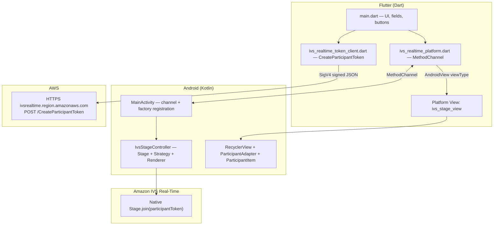

# Amazon IVS Real-Time + Flutter — Technical Documentation

> **Repository layout:** this tree is now the **`aws_ivs_realtime` Flutter plugin**; the runnable demo lives under **`example/`**. Native registration uses **`AwsIvsRealtimePlugin`** and the channel name **`aws_ivs_realtime/stage`** (see `README.md`). Sections below may still reference older paths or channel names from the pre-plugin layout.

This document describes how **this repository** implements a **demo** flow: mint an IVS Real-Time **participant token** entirely in **Dart** (no separate backend), then join an IVS **stage** on **Android** using the official **Amazon IVS Broadcast** native SDK (stages variant), bridged with a **MethodChannel** and an **Android Platform View**.

> **Scope:** Android and iOS both implement the native stage (`AwsIvsRealtimePlugin` + `IvsStageController`).  
> **Security:** The demo stores IAM credentials in-process (and may use `String.fromEnvironment` defaults in `lib/main.dart` for convenience). Do not ship this pattern to production or commit secrets to public repositories.

---

## Table of contents

1. [Architecture](#1-architecture)  
2. [Prerequisites and versions](#2-prerequisites-and-versions)  
3. [End-to-end user flow](#3-end-to-end-user-flow)  
4. [Flutter / Dart layer](#4-flutter--dart-layer)  
5. [Token minting (SigV4 + HTTP)](#5-token-minting-sigv4--http)  
6. [Method channel contract](#6-method-channel-contract)  
7. [Android native layer](#7-android-native-layer)  
8. [Android file reference](#8-android-file-reference)  
9. [AWS configuration](#9-aws-configuration)  
10. [Build and run](#10-build-and-run)  
11. [Troubleshooting](#11-troubleshooting)  
12. [References](#12-references)  
13. [AWS-only stream catalog (ListStages + tags)](#13-aws-only-stream-catalog-liststages--tags)  
14. [Amazon IVS Chat (YouTube-style messages)](#14-amazon-ivs-chat-youtube-style-messages)

---

## 1. Architecture



**Summary**

| Layer | Responsibility |
|--------|------------------|
| Dart | Collect region, stage ARN, IAM keys; call AWS control plane; hold participant token; invoke native join/leave/publish. |
| MethodChannel | Binary messages between Dart VM and Android `MainActivity`. |
| Android | IVS Broadcast **stages** AAR: `Stage`, `DeviceDiscovery`, local/remote streams, `RecyclerView` UI. |
| Platform view | Embeds native `RecyclerView` in Flutter widget tree (`AndroidView`). |

---

## 2. Prerequisites and versions

| Item | Value / note |
|------|----------------|
| Flutter (FVM) | `.fvm/version` → **3.41.7** |
| Dart SDK constraint | `pubspec.yaml` → `sdk: ^3.11.5` |
| Android `minSdk` | **28** (required by Amazon IVS Real-Time / stages sample alignment) |
| Android `compileSdk` / Kotlin / Java | From Flutter Gradle plugin; Java **17**, Kotlin JVM target **17** in `android/app/build.gradle.kts` |
| Device | **Android** physical device or emulator **API 28+** for native stage + camera/mic. |

---

## 3. End-to-end user flow

1. User enters (or relies on defaults for) **AWS region**, **stage ARN**, **access key id**, **secret access key**, optional **session token**, optional **userId**.  
2. **Mint token (SigV4)** → Dart builds JSON body → signs with IAM credentials → `POST https://ivsrealtime.<region>.amazonaws.com/CreateParticipantToken` → parses `participantToken.token` → stores in memory (`_lastToken`).  
3. **Join / leave stage** → Dart calls MethodChannel `join` with `{ token, publish }`.  
4. Android `IvsStageController` requests **RECORD_AUDIO** always; **CAMERA** additionally if `publish` is true. After grants, builds `ImageLocalStageStream` + `AudioLocalStageStream`, creates `Stage(application, token, strategy)`, `addRenderer`, `join()`.  
5. **Leave** → `stage.leave()` on native thread.  
6. **Publish camera + mic** switch updates native `publishEnabled` via `setPublish` and toggles `Stage.refreshStrategy()` behavior.  
7. The **participant grid** is a native `RecyclerView` inside `AndroidView(viewType: 'ivs_stage_view')`.

---

## 4. Flutter / Dart layer

### 4.1 Entry and UI (`lib/main.dart`)

- **`main()`** calls `WidgetsFlutterBinding.ensureInitialized()` then `runApp(const IvsDemoApp())`.  
- **`IvsDemoApp`** — `MaterialApp` with seed theme.  
- **`IvsDemoPage`** — stateful demo screen:
  - **TextEditingController**s for region, stage ARN, access key, secret, session token, userId.  
  - Initial `text` values use **`const String.fromEnvironment(..., defaultValue: ...)`** so you can override at compile time with `--dart-define=KEY=value` without editing source, while still allowing runtime edits in the `TextField`s.  
  - **Per your project:** optional non-empty `defaultValue`s for region/stage/credentials may be present in source for local demo convenience (see the controller declarations in `lib/main.dart`).  
  - **`_mintToken`** → `IvsRealtimeTokenClient.createParticipantToken(...)`.  
  - **`_toggleStage`** → guards `Platform.isAndroid`, then `IvsRealtimePlatform.join`.  
  - **`_leave`** → `IvsRealtimePlatform.leave`.  
  - **`AndroidView`** — only on Android; `viewType: 'ivs_stage_view'` must match the factory id registered in Kotlin. Uses `StandardMessageCodec` and `TextDirection.ltr`.  
  - On non-Android, a placeholder `ColoredBox` explains native grid is Android-only.

### 4.2 Platform bridge (`lib/ivs_realtime_platform.dart`)

- **Method channel (must match Android and iOS):**  
  `aws_ivs_realtime/stage`  
- **Stage events (EventChannel):**  
  `aws_ivs_realtime/stage_events`
- **Class:** `IvsRealtimePlatform`  
- **Methods invoked from Dart:**
  - `join` — arguments: `Map` with keys **`token`** (`String`), **`publish`** (`bool`). Throws `UnsupportedError` if not Android. Wraps `PlatformException` in `IvsStageException`.  
  - `leave` — no arguments; no-op on non-Android.  
  - `setPublish` — argument: `bool`.

---

## 5. Token minting (SigV4 + HTTP)

**File:** `lib/ivs_realtime_token_client.dart`  
**Class:** `IvsRealtimeTokenClient`

### 5.1 AWS API

- **Operation:** [CreateParticipantToken](https://docs.aws.amazon.com/ivs/latest/RealTimeAPIReference/API_CreateParticipantToken.html)  
- **Method / path:** `POST /CreateParticipantToken`  
- **Host:** `ivsrealtime.<region>.amazonaws.com` (e.g. `ivsrealtime.us-east-1.amazonaws.com`)  
- **Request `Content-Type`:** `application/json`  
- **Body (JSON):** at minimum `stageArn`; this app also sends `capabilities` (`PUBLISH`, `SUBSCRIBE`), `duration` (minutes), and optional `userId`.

### 5.2 Response handling

- Expect **HTTP 200** and JSON containing `participantToken.token` (opaque string passed to native `Stage.join`).

### 5.3 Signing (critical detail)

Implementation uses:

- **`package:aws_signature_v4`** — `AWSSigV4Signer` with `AWSCredentialsProvider(AWSCredentials(...))`.  
- **`package:aws_common`** — `AWSHttpRequest.post`, `AWSCredentialScope`, `AWSService`, `AWSHeaders`.

**Important:** The **HTTP host** is the **ivsrealtime** endpoint, but the **SigV4 credential scope service name** must be **`ivs`**, not `ivsrealtime`. If you sign with `ivsrealtime`, AWS returns **403** with a message like *"Credential should be scoped to correct service: 'ivs'."*

```text
Canonical request → host: ivsrealtime.us-east-1.amazonaws.com
Credential scope  → .../us-east-1/ivs/aws4_request
```

### 5.4 Dependencies (`pubspec.yaml`)

| Package | Role |
|---------|------|
| `aws_common` | HTTP request types, headers, credentials, `AWSHttpClient.send` via signed request. |
| `aws_signature_v4` | SigV4 signing. |
| `http` | Declared; primary send path uses `aws_common` signed request’s `.send()`. |

### 5.5 Errors

- **`IvsTokenException`** — non-200 HTTP or missing `token` in JSON body.

---

## 6. Method channel contract

**Method channel:** `aws_ivs_realtime/stage`  
**Events channel:** `aws_ivs_realtime/stage_events`  
**Registrar:** `AwsIvsRealtimePlugin` (Android `FlutterPlugin` + `ActivityAware`), `AwsIvsRealtimePlugin.register` (iOS).

| Method (Dart → native) | Arguments | Android behavior | Result |
|------------------------|-----------|------------------|--------|
| `join` | `Map`: `token` String, `publish` bool | Sets publish flag; if connected, **leaves** and succeeds; else requests permissions, then `Stage.join` | `success(null)` or `error(code, message, ...)` |
| `leave` | — | `stage.leave()` on main handler | `success(null)` |
| `setPublish` | `bool` | Updates `publishEnabled`, `refreshStrategy` | `success(null)` |
| `refreshStageBindings` | — | Main thread: `stage?.refreshStrategy()`, `participantAdapter.notifyDataSetChanged()` | `success(null)` |
| `setLocalStreamMuted` | `Map`: `micMuted` bool, `cameraMuted` bool | Main thread: mutes local `AudioLocalStageStream` / `ImageLocalStageStream` | `success(null)` |
| `setShowParticipantStateOverlay` | `Map`: `visible` bool (default **false**) | Shows or hides per-tile debug strip (subscribe/mute/dB); when `false`, tiles are video-only | `success(null)` |

**Android join semantics:** If `connectionState != DISCONNECTED`, the handler treats the call as **toggle leave** (matches sample-style UX bundled into one button on the Flutter side).

---

## 7. Android native layer

### 7.1 Gradle

- **Plugin module** `android/build.gradle.kts` — declares `com.amazonaws:ivs-broadcast` **stages** AAR and RecyclerView for the participant grid.  
- **Example app** `example/android/app/build.gradle.kts` — **`minSdk = 28`** (IVS Real-Time alignment); see that file for `compileSdk` / Java **17** (same family as [AWS Android Real-Time sample](https://github.com/aws-samples/amazon-ivs-real-time-streaming-android-samples)).

### 7.2 Manifest (`android/app/src/main/AndroidManifest.xml`)

Declared permissions:

- `INTERNET` — HTTPS to AWS + Real-Time media signaling.  
- `RECORD_AUDIO` — subscribe + publish audio path.  
- `CAMERA` — publish video when enabled.  
- `MODIFY_AUDIO_SETTINGS` — used with IVS Bluetooth SCO helpers in sample-style integration.

### 7.3 `AwsIvsRealtimePlugin.kt` (plugin entry)

- Package: **`dev.aws.ivs_realtime`** (see `android/src/main/kotlin/dev/aws/ivs_realtime/`).  
- Implements **`FlutterPlugin`** + **`ActivityAware`**. On activity attach:  
  1. Builds **`IvsStageController(activity)`** (Activity reference for permissions and context).  
  2. Registers **`PlatformViewFactory`** id **`ivs_stage_view`** → **`IvsStageViewFactory`**.  
  3. Registers **`MethodChannel("aws_ivs_realtime/stage")`** and **`EventChannel("aws_ivs_realtime/stage_events")`**; routes `join` / `leave` / `setPublish` / `refreshStageBindings` / `setLocalStreamMuted` / `setShowParticipantStateOverlay` as in section 6.  
- **`onDetachedFromActivity`** — `controller.release()` to free `Stage` and `DeviceDiscovery`.  
- **Permissions** — `ActivityPluginBinding.addRequestPermissionsResultListener` forwards to `IvsStageController.onRequestPermissionsResult`.

### 7.4 `IvsStageController.kt`

Single class implementing:

- **`com.amazonaws.ivs.broadcast.Stage.Strategy`** — what to publish/subscribe.  
- **`com.amazonaws.ivs.broadcast.StageRenderer`** — participant lifecycle, streams, errors, connection state.

**State:**

- `participantAdapter` — exposed to `IvsStageViewFactory` for the `RecyclerView`.  
- `deviceDiscovery` — `DeviceDiscovery(app)`.  
- `stage` — current `Stage` instance.  
- `streams` — `MutableList<LocalStageStream>` (camera + mic when devices resolved).  
- `publishEnabled` — mirrors Flutter switch; affects `shouldPublishFromParticipant`.  
- `connectionState` — updated in `onConnectionStateChanged`.  
- `pendingJoinToken` / `pendingJoinResult` — ties async permission flow to Flutter `MethodChannel.Result` (must complete exactly once).

**Join flow (`joinOrLeave`):**

1. Posts work to **main thread** (`Handler(Looper.getMainLooper())`).  
2. If already connected → `leaveInternal()`, `result.success(null)`.  
3. Validates non-empty token.  
4. Stores pending token + result.  
5. Builds permission list: always **RECORD_AUDIO**; **CAMERA** if `publishEnabled`.  
6. If already granted → `permissionGranted()`, `performJoin(token)`, `finishJoinSuccess()`.  
7. Else **`ActivityCompat.requestPermissions`** with request code **`0x49565301`** (`REQUEST_JOIN_PERMISSIONS`).

**`onRequestPermissionsResult`:** If denied → `result.error(PERMISSION_DENIED, ...)`. If granted → `permissionGranted()`, `performJoin`, `result.success` on success.

**`performJoin`:** `Bluetooth.startBluetoothSco(app)`; release old `stage`; `Stage(app, token, this)`, `addRenderer(this)`, `join()`. On **`BroadcastException`**, `result.error(JOIN_FAILED, ...)` and clears pending.

**`Stage.Strategy`:**

- `stageStreamsToPublishForParticipant` → returns `streams` (local camera/mic wrappers).  
- `shouldPublishFromParticipant` → `publishEnabled`.  
- `shouldSubscribeToParticipant` → `AUDIO_VIDEO` for all remote participants.

**`StageRenderer`:** Implements participant joined/left, publish/subscribe state, streams added/removed/muted — updates **`ParticipantAdapter`** (pattern aligned with AWS **BasicRealTime** sample).

**`release`:** `stage.release()`, `deviceDiscovery.release()`, `Bluetooth.stopBluetoothSco`.

### 7.5 `IvsStageViewFactory.kt`

- Extends `PlatformViewFactory(StandardMessageCodec.INSTANCE)`.  
- **`create`** — builds `RecyclerView`, sets `StageLayoutManager(context)`, `adapter = controller.participantAdapter`.  
- **`dispose`** — no-op for stage lifecycle (owned by controller / activity).

### 7.6 Participant UI (ported from AWS BasicRealTime concepts)

| File | Role |
|------|------|
| `ParticipantAdapter.kt` | `RecyclerView.Adapter`; list of `StageParticipant`; stable IDs. |
| `ParticipantItem.kt` | Custom `FrameLayout`; inflates `item_stage_participant.xml`; binds preview via `ImageDevice.getPreviewView`, audio stats via `AudioDevice.setStatsCallback`. |
| `StageParticipant.kt` | Model: local/remote, `participantId`, publish/subscribe state, `streams`. |
| `StageLayoutManager.kt` | `GridLayoutManager` span 6 with predefined row/column layouts for 1–12 participants; non-scrolling. |
| `res/layout/item_stage_participant.xml` | Root custom view `ParticipantItem`; ids match `ParticipantItem.kt` `findViewById` targets. |

---

## 8. Android file reference

```text
lib/                          # published Dart API
  ivs_realtime_platform.dart
  ivs_live_control_plane.dart
  ...
android/src/main/kotlin/dev/aws/ivs_realtime/
  AwsIvsRealtimePlugin.kt
  IvsStageController.kt
  IvsStageViewFactory.kt
  ParticipantAdapter.kt
  ParticipantItem.kt
  StageLayoutManager.kt
  StageParticipant.kt
android/src/main/res/layout/
  item_stage_participant.xml
example/lib/                  # demo app (lobby + full_screen_live_page)
example/android/app/...
ios/Classes/
  AwsIvsRealtimePlugin.swift
  IvsStageNative.swift
```

---

## 9. AWS configuration

### 9.1 Resources

- **Stage ARN** — format `arn:aws:ivs:<region>:<account-id>:stage/<stage-id>`. Used in `CreateParticipantToken` body as `stageArn`.  
- **RTMPS / channel ingest** — separate product surface (IVS *channels*); not used by this Real-Time **stage** demo.

### 9.2 IAM

- Service prefix in IAM for these APIs: **`ivs`** (Amazon Interactive Video Service).  
- **Minimal policy (token only):** `ivs:CreateParticipantToken` on target stage ARNs.  
- **With in-app catalog (`ivs_realtime_stages_api.dart`):** also allow **`ivs:ListStages`**, **`ivs:CreateStage`**, **`ivs:TagResource`** (required when `CreateStage` includes **`tags`** — title/description), **`ivs:DeleteStage`**, and **`ivs:CreateParticipantToken`** (resource scope often `arn:aws:ivs:REGION:ACCOUNT:stage/*` for demos — tighten for production).  
- Official actions/resources reference: [Actions, resources, and condition keys for Amazon IVS](https://docs.aws.amazon.com/service-authorization/latest/reference/list_amazoninteractivevideoservice.html).

### 9.3 Credentials in the app

- **Access key ID + secret access key** — long-term IAM user keys: no session token.  
- **Session token** — only when using **temporary** credentials (STS, SSO export, assumed role, etc.).

---

## 10. Build and run

From project root (with FVM):

```bash
fvm flutter pub get
fvm flutter run
```

Optional compile-time overrides (examples):

```bash
fvm flutter run \
  --dart-define=AWS_REGION=us-east-1 \
  --dart-define=AWS_STAGE_ARN=arn:aws:ivs:us-east-1:ACCOUNT:stage/STAGEID \
  --dart-define=AWS_ACCESS_KEY_ID=AKIA... \
  --dart-define=AWS_SECRET_ACCESS_KEY=...
```

Debug APK:

```bash
fvm flutter build apk --debug
```

---

## 11. Troubleshooting

| Symptom | Likely cause | What to check |
|---------|----------------|----------------|
| `403` *Credential should be scoped to correct service: 'ivs'* | Wrong SigV4 service in scope | `AWSCredentialScope` uses `AWSService('ivs')` while host remains `ivsrealtime.<region>.amazonaws.com` (`ivs_realtime_token_client.dart`). |
| `403` AccessDenied | IAM policy missing `ivs:CreateParticipantToken` or wrong resource ARN | IAM policy simulator; stage ARN vs channel ARN. |
| `403` *not authorized to perform: ivs:TagResource* | **`CreateStage`** sends **tags** (title/description); IAM needs **`ivs:TagResource`** on `arn:aws:ivs:REGION:ACCOUNT:stage/*` | Add `ivs:TagResource` to the same user/policy as `CreateStage`. |
| `404` ResourceNotFound | Invalid stage ARN or wrong region in URL | Region in URL matches stage; ARN copied from IVS console **Real-time** / **Stages**. |
| Native join fails / Toast | Invalid or expired participant token; network | Mint fresh token; device clock; internet. |
| Black / empty grid on Android | Permissions denied or publish off with no remote video | Grant mic/camera; ensure another publisher on stage. |
| iOS build / CocoaPods | Pod resolution or arch flags | Match `example/ios/Podfile`; `AmazonIVSBroadcast/Stages` in `ios/aws_ivs_realtime.podspec`. |

---

## 12. References

- [CreateParticipantToken — Amazon IVS Real-Time API](https://docs.aws.amazon.com/ivs/latest/RealTimeAPIReference/API_CreateParticipantToken.html)  
- [Amazon IVS Real-Time Streaming Android samples](https://github.com/aws-samples/amazon-ivs-real-time-streaming-android-samples)  
- [Amazon IVS Real-Time Streaming iOS samples](https://github.com/aws-samples/amazon-ivs-real-time-streaming-ios-samples)  
- [Flutter PlatformView / AndroidView](https://docs.flutter.dev/platform-integration/android/platform-views)  
- [Flutter MethodChannel](https://docs.flutter.dev/platform-integration/platform-channels)  
- [AWS SigV4 signing — `aws_signature_v4` (pub.dev)](https://pub.dev/packages/aws_signature_v4)

---

## 13. AWS-only stream catalog (ListStages + tags)

**File:** `lib/ivs_realtime_stages_api.dart` (`IvsRealtimeStagesApi`)

The app can treat **IVS stages + resource tags** as a lightweight catalog **without** DynamoDB or Lambda:

| API | Path | Purpose |
|-----|------|---------|
| [ListStages](https://docs.aws.amazon.com/ivs/latest/RealTimeAPIReference/API_ListStages.html) | `POST /ListStages` | Enumerate stages in the account/region (paginated). |
| [CreateStage](https://docs.aws.amazon.com/ivs/latest/RealTimeAPIReference/API_CreateStage.html) | `POST /CreateStage` | Create a stage; set **`name`** (pattern `[a-zA-Z0-9-_]*`) and **`tags`**. |
| [TagResource](https://docs.aws.amazon.com/ivs/latest/RealTimeAPIReference/API_TagResource.html) | (implicit / separate) | AWS evaluates **`ivs:TagResource`** when **`CreateStage`** includes **`tags`** (title/description). IAM must allow it on `stage/*`. |
| [DeleteStage](https://docs.aws.amazon.com/ivs/latest/RealTimeAPIReference/API_DeleteStage.html) | `POST /DeleteStage` | Body `{"arn":"<stage-arn>"}` removes the stage (host **End stream**). |

**Demo tag keys** (constants on `IvsRealtimeStagesApi`):

- `demoTitle` — display title (tag value max **256** chars; truncated in UI builder).  
- `demoDescription` — display description (same limit).  
- `demoStatus` — `live` while listed as “live”; host ending the stream uses **DeleteStage** so the row disappears after refresh.

**`lib/main.dart` UX**

- **Refresh** (app bar): calls `ListStages`, filters with `stageIsLiveDemo()` (`demoStatus == live`).  
- **Go live** (FAB): dialog for title + description → `buildStageNameAndTags()` → `CreateStage` → mint token with **`PUBLISH` + `SUBSCRIBE`** → native join as publisher. Remembers **`_hostStageArn`** for **End stream**.  
- **Tap a card**: `CreateParticipantToken` with **`SUBSCRIBE`** only → native join with publish **false** (viewer).  
- **Manual join** (expansion tile): still uses **Stage ARN** field + **Mint token** + **Join / leave** with capabilities derived from the publish switch.

All control-plane calls use the same host and SigV4 **`ivs`** scope as `CreateParticipantToken` (see §5.3).

---

## 14. Amazon IVS Chat (YouTube-style messages)

Video stays on **IVS Real-Time** (`ivs` / `ivsrealtime` endpoints). Text chat uses **Amazon IVS Chat** — a separate AWS control plane and a **WebSocket** edge endpoint.

| Piece | File / detail |
|--------|----------------|
| Chat REST API (SigV4 service **`ivschat`**) | `lib/ivs_chat_api.dart` — `CreateRoom`, `DeleteRoom`, `CreateChatToken` on `https://ivschat.<region>.amazonaws.com` |
| WebSocket client | `lib/ivs_chat_session.dart` — `wss://edge.ivschat.<region>.amazonaws.com` with the chat token as the [WebSocket subprotocol](https://docs.aws.amazon.com/ivs/latest/ChatUserGuide/getting-started-chat-send-and-receive.html) |
| Link stage ↔ room | Stage tag **`demoChatRoomArn`** (`IvsRealtimeStagesApi.tagChatRoomArn`) holds the **room ARN** (`arn:aws:ivschat:...:room/...`) so subscribers can open the same chat after **ListStages**. |

**Go live:** `CreateRoom` → `CreateStage` (tags include `demoChatRoomArn`) → video join → `CreateChatToken` + WebSocket (host can **SEND_MESSAGE**).  

**End stream:** disconnect WebSocket → `DeleteRoom` → `DeleteStage`.  

**IAM (demo):** allow **`ivschat:CreateRoom`**, **`ivschat:DeleteRoom`**, **`ivschat:CreateChatToken`** (and **`ivschat:TagResource`** if you add tags on `CreateRoom`). Use the IAM policy editor or [CreateChatToken](https://docs.aws.amazon.com/ivs/latest/ChatAPIReference/API_CreateChatToken.html) docs to scope resources (e.g. `arn:aws:ivschat:REGION:ACCOUNT:room/*`).  

**Production:** mint chat tokens **server-side**; do not ship IAM keys in the app ([CreateChatToken](https://docs.aws.amazon.com/ivs/latest/ChatAPIReference/API_CreateChatToken.html)).

---

*Document aligns with the **`aws_ivs_realtime`** Flutter plugin (pub package name); use a GitHub repo name such as **`aws_ivs_realtime`** for consistency with pub.dev.*
